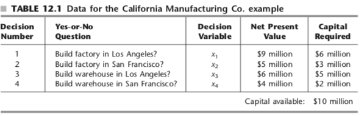

```{r setup, include=FALSE}
knitr::opts_chunk$set(warning = FALSE, message = FALSE)
```

***

# California Manufacturing Co.

The CALIFORNIA MANUFACTURING COMPANY is considering expansion by building a new factory in either Los Angeles or San Francisco, or perhaps even in both cities. It also is considering building at most one new warehouse, but the choice of location is restricted to a city where a new factory is being built. The net present value (total profitability considering the time value of money) of each of these alternatives is shown in the fourth column of Table 12.1. The rightmost column gives the capital required (already included in the net present value) for the respective investments, where the total capital available is $10 million. The objective is to find the feasible combination of alternatives that maximizes the total net present value. 


```{r}
library(lpSolveAPI)
x <- read.lp("CalMan.lp")
x
```


```{r}
solve(x)
get.objective(x)
get.variables(x)
```
The optimal solution is Z = 14, with x1 and x2 = 1.

***

# Branch and Bound 

We are given the following problem.

max 8x1 + 5x2
ST
x1 + x2 <= 6
9x1 + 5x2 <= 45

integers x1, x2

Let us first use lpsolve to solve the problem
```{r}
x <- read.lp("sp1.lp")
x
solve(x)
get.objective(x)
get.variables(x)
```

***

## Root node

Let us now apply the BB concept to solve the above problem.

```{r}
# Demonstrate IP Branch-and-Bound
rn <- make.lp(0, 2) # number of constraints, number of decision variables
lp.control(rn, sense="max", verbose = "neutral") # Default is minimization, so we need to do this for maximization problems
set.objfn(rn, c(8, 5))
add.constraint(rn, c(1, 1), "<=", 6)
add.constraint(rn, c(9, 5), "<=", 45)
RowNames <- c("Labor", "Wood")
ColNames <- c("Tables", "Chairs")
dimnames(rn) <- list(RowNames, ColNames)
rn
solve(rn)
get.objective(rn)
get.variables(rn)
```

Now, add the solution to the root node
```{r}
library("data.tree") # Use this to visualize your solution tree

root <- Node$new("Root Node: Z=41.25, x1 = 3.75, x2=2.25")
```

***

### Subproblem

Now, we have a choice. We will consider values for x1 <=3 (subproblem 3), and x1 >= 4 (subproblem 2)
Let us proceed along Subproblem 2

#### Subproblem 2 (root + x1 >= 4)


```{r}
# sp2 = RP +  x1 >= 4
sp2 <- make.lp(0, 2) # number of constraints, number of decision variables
lp.control(sp2,sense="max")
set.objfn(sp2, c(8, 5))
add.constraint(sp2, c(1, 1), "<=", 6)
add.constraint(sp2, c(9, 5), "<=", 45)
add.constraint(sp2,c(1,0),">=",4)
solve(sp2)
get.objective(sp2)
get.variables(sp2)
```

Add to the tree
```{r}
sub_2 <- root$AddChild("Subproblem 2: RN +  x1 >= 4; Z = 41, x1 = 4, x2 = 1.8 - Solution is not feasible")
```

***

Let us divide sp2 into two parts: x2 >= 2 (sp4) and x2 <= 1 (sp5)

#### Subproblem 4 (SP2 + x2 >= 2)

```{r}
sp4 <- make.lp(0, 2) # number of constraints, number of decision variables
set.objfn(sp4, c(8, 5))
lp.control(sp4,sense="max")
add.constraint(sp4, c(1, 1), "<=", 6)
add.constraint(sp4, c(9, 5), "<=", 45)
add.constraint(sp4,c(1,0),">=",4)
add.constraint(sp4,c(0,1),">=",2)
solve(sp4)
get.objective(sp4)  # This solution is infeasible
```

Add to the tree
```{r}
sub_4 <- sub_2$AddChild("Subproblem 4: SP2 + x2 >= 2; Solution is infeasible")
```

***

#### Subproblem 5 (SP2 + x2 <= 1)

```{r}
sp5 <- make.lp(0, 2) # number of constraints, number of decision variables
  set.objfn(sp5, c(8, 5))
  lp.control(sp5,sense="max",verbose="neutral")
  add.constraint(sp5, c(1, 1), "<=", 6)
  add.constraint(sp5, c(9, 5), "<=", 45)
  add.constraint(sp5,c(1,0),">=",4)
  add.constraint(sp5,c(0,1),"<=",1)
  solve(sp5)
  get.objective(sp5) 
  get.variables(sp5)
```

Now add to the tree

  
```{r}
sub_5 <- sub_2$AddChild("Subproblem 5: SP2 + X2 <=1; Z = 40.56, x1 = 4.44, x2 = 1 - Solution is not feasible")
```

***

#### Subproblem 6 (SP 5 + x1 >= 5)
```{r}
sp6 <- make.lp(0, 2) # number of constraints, number of decision variables
set.objfn(sp6, c(8, 5))
lp.control(sp6,sense="max",verbose="neutral")
add.constraint(sp6, c(1, 1), "<=", 6)
add.constraint(sp6, c(9, 5), "<=", 45)
add.constraint(sp6,c(1,0),">=",5)
add.constraint(sp6,c(0,1),"<=",1)
solve(sp6)
get.objective(sp6)
get.variables(sp6) # This is a feasible solution
```

Add to the tree
```{r}
sub_6 <- sub_5$AddChild("Subproblem 6: SP5 + x1 >= 5; Z = 40, x1 = 5, x2 = 0 - This solution is feasible; and optimal")
```

#### Subproblem 7 (SP5 + x1 <= 4)

Note, that we already have x1 >= 4 in SP2, so the constraint here is x1 = 4
```{r}
sp7 <- make.lp(0, 2) # number of constraints, number of decision variables
set.objfn(sp7, c(8, 5))
lp.control(sp7, sense="max")
add.constraint(sp7, c(1, 1), "<=", 6)
add.constraint(sp7, c(9, 5), "<=", 45)
add.constraint(sp7,c(1,0),"=",4)
add.constraint(sp7,c(0,1),"<=",1)
solve(sp7)
get.objective(sp7) 
get.variables(sp7) # This is also feasbile, but lower than SP6
```

This solution is feasible, but lower than SP6. Add to the tree
```{r}
sub_7 <- sub_5$AddChild("Subproblem 7: SP5 + Z<= 4; Z = 37, x1 = 4, x2 = 1. The solution is feasible, but not optimal")
```

***

Our best solution  so far is SP6 with objective of 40.

***

Now, we explore the other branch from the root. Specifically, 

#### Subproblem 3 (Root + x1 <= 3)
```{r}
sp3 <- make.lp(0, 2) # number of constraints, number of decision variables
set.objfn(sp3, c(8, 5))
lp.control(sp3,sense="max")
add.constraint(sp3, c(1, 1), "<=", 6)
add.constraint(sp3, c(9, 5), "<=", 45)
add.constraint(sp3,c(1,0),"<=",3)
solve(sp3)
get.objective(sp3)
get.variables(sp3)
sub_3 <- root$AddChild("Subproblem 3: RN + x1 <= 3; Z= 39, x1 = 3, x2=3; Feasible, but not optimal")
```

Add to the tree
This is a feasible solution, but not optimal as its value is less than SP6 with Z = 40. As this was the solution to the LP relaxation problem, you will find no better solution along this branch. We now have our optimal solution.

Print out the tree
```{r}
print(root)
```


