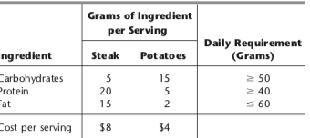

```{r setup, include=FALSE}
knitr::opts_chunk$set(warning = FALSE, message = FALSE)
dir.create("images")
```

***
## Introduction

This notebook contains the code for the examples in Chapter 4. Specifically, the formulation for the Diet Problem stated in Problem 3.4-8 in the Hillier and Lieberman text

***

## Problem Description
Ralph Edmund loves steaks and potatoes. Therefore, he has decided to go on a steady diet of only these two foods for all his meals. Ralph realizes that this isn’t the healthiest diet, so he wants to make sure that he eats the right quantities of the two foods to satisfy some key nutritional requirements. He has obtained the nutritional and cost information shown below. Ralph wishes to determine the number of daily servings (may be fractional) of steak and potatoes that will meet these requirements at a minimum cost.



## Install Libraries
Uncomment and install the lpSolveAPI if needed. If you already did this for a previous problem, you do not have to install the package again.

```{r}
#install.packages("lpSolveAPI")
```

Now, load the library
```{r}
library(lpSolveAPI)
```

***
## Model Formulation - Hardcoded 

Let us set up the problem. Note that we had two decision variables, and three constraints.
In the first formulation, we will directly create the objective function and constraints
```{r}
# make an lp object with 0 constraints and 2 decision variables
lprec <- make.lp(0, 2)

# Now create the objective function. The default is a minimization problem. 
set.objfn(lprec, c(8, 4))

# The default is a minimization problem, so we can skip the next statement
lp.control(lprec,sense='min')

# Add the three nutritional constraints
add.constraint(lprec, c(5, 15), ">=", 50)
add.constraint(lprec, c(20, 5), ">=", 40)
add.constraint(lprec, c(15, 2), "<=", 60)

# Set bounds for variables.
# Remember that all variables had to be non-negative. We don't need to to do it here, as that is the default,
# we can set bounds explicitly
set.bounds(lprec, lower = c(0, 0), columns = c(1, 2)) #Not really needed

# To identify the variables and constraints, we can
# set variable names and name the constraints
RowNames <- c("Carbohydrates", "Protein", "Fat")
ColNames <- c("Steaks", "Potatoes")
dimnames(lprec) <- list(RowNames, ColNames)

# Now, print out the model
lprec

# The model can also be saved to a file
write.lp(lprec, filename = "diet.lp", type = "lp")


```

We now solve the above LP problem
```{r}
solve(lprec)
```

The output above doesn't indicate that the answer is 0, but that there was a successful solution
We now output the value of the objective function, and the variables
```{r}
get.objective(lprec)
get.variables(lprec)
```

The solution shows that the total cost is 21.82, and that he should eat 1.3 Steaks and 2.9 potatoes. 

One difficulty in reading the output is that lpsolveAPI will not write the variable name next to the solution. As such, you should remember that the variables values are output in the order in which it shows up in the lp formulation. In our case, it was Steak, and then Potatoes. 

***

## Model Formulation - Using lp file

Before we look at other output values, let us consider using a different method to input the problem formuation. We will use the lp format by creating a text file that contains the Diet problem formulation. We actually did as part of the previous output. You could alternatively just create the lp file using a text editor, or from with RStudio. Make sure that the extension is .lp. 

Please now look at the diet.lp file. In RStudio, you can double click on the file in the Files list on the right pane.

We now read the lp formulation using an lp file. To read about about the lp format for files, you can read the documentation at http://lpsolve.sourceforge.net/5.5/lp-format.htm. 
```{r}
lprec <- read.lp("diet.lp") # create an lp object lprec
lprec                          # display lprec
```

Solve the lp model
```{r}
solve(lprec)
get.objective(lprec)        # get objective value
get.variables(lprec)        # get values of decision variables
get.constraints(lprec)      # get constraint RHS values
```

If you run all the chunks above, you can display the text, code, and output in an html file. Click on the 4.2-DietProblem.nb.html file in your directory from withing RStudio.

***

# Quiz

Let us now incorporate Kale into our formulation. I will modify the lp model file with the new variable.
```{r}
x <- read.lp("diet_kale.lp") # create an lp object x
x                          # display x
```
Solve the LP model
```{r}
solve(x)
get.objective(x)        # get objective value
get.variables(x)        # get values of decision variables
get.constraints(x)      # get constraint RHS values
```

Note that lowering the requirement of total fat to 20g, and adding Kale to the mix of foods changed the composition of Ralph's diet. He now eats a large portion of Kale and a much smaller portion of Steak. His potatoe consumption has also reduced.