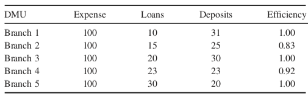

```{r setup, include=FALSE}
knitr::opts_chunk$set(warning = FALSE, message = FALSE)
```

***

This contains the code for the examples in the DEA module

***

Metropolis National Bank operates five branches around the city. The branches all offer the same services and rely on identical mixes of labor and capital. As a result, the cost of operation is the same at each branch, although their profiles of loans and deposits differ. The following table summarizes the level of branch performance for the previous quarter.



Let us now calculate the weights to acheive the efficiency values for each DMU (Branch)

***

### DMU(1)

```{r}
library(lpSolveAPI)
dmu1 <- read.lp("DMU1.lp")
dmu1
solve(dmu1)
get.objective(dmu1)
get.variables(dmu1)
```


The solution indicates that the objective value is 1, which indicates that we are able to achieve maximum efficiency for DMU(1). This happens when we use the weights 0 and 0.03226 for the outputs, and 0.01 for the input. In other words, if we provide the greatest weight to deposits, then DMU(1) is the most efficient. 

Can you modify and rerun the model for all other DMUs?

****

## Using Benchmarking Libraries for DEA

We will now run DEA analysis using the benchmarking library. First, install the library, if you don't have it already. Uncomment the code, i.e., remove the #, to run it.

```{r}
#install.packages("Benchmarking")
library(Benchmarking)
```

Now, we read our input data. We will read the data as input and output as vectors. Remember our problem had 5 DMUs with expenses as input and loans and deposits as outputs.

```{r}
x <- matrix(c(100,100,100,100,100))
y <- matrix(c(10,15,20,23,30,31,25,30,23,20),ncol = 2)
colnames(y) <- c("loans","deposits")
colnames(x) <- c("expenses")
x
y
```

We now run the DEA analysis. We use the option of CRS, Constant Return to Scale. More on this later.
```{r}
e <- dea(x,y,RTS = "crs")            # provide the input and output 
e
peers(e)                             # identify the peers
lambda(e)                            # identify the relative weights given to the peers
#dea.plot.isoquant(x,y,RTS="crs")     # plot the results
```
***
The results indicate that DMUs 1, 3, and 5 are efficient. DMU(2) is only 83% efficient, and DMU(4) is 92% efficient. This is what we found in our initial discussion. Further, the peer units for DMU(2) are 1 and 3, with relative weights 0.16 and 0.68. Similary for DMU(4), the peer units are 3 and 5, with weights 0.46 and 0.46, respectively.
***

Can you rerun the above model by changing RTS type from CRS to other models? You can type ?dea in the console to get the help file for dea, and the possible values for RTS.

